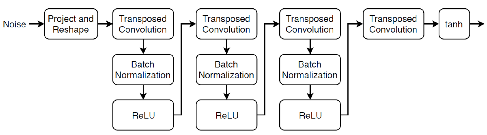
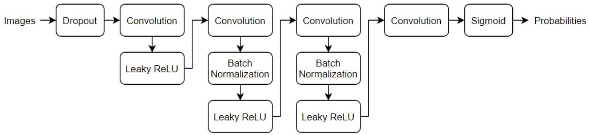
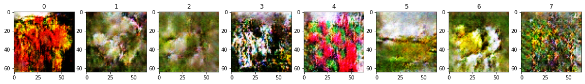
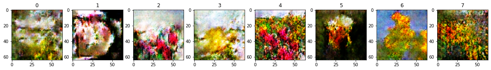

# GAN-on-tf-dataset-flowers
Implement a DCGAN architecture that is introduced in [Matlab website](https://uk.mathworks.com/help/deeplearning/ug/train-generative-adversarial-network.html). 
This model trained on tensorflow [flower dataset](https://www.tensorflow.org/datasets/catalog/tf_flowers). training part is based on [tensorflow documentation](https://www.tensorflow.org/tutorials/generative/dcgan).  

# Architecture 
This architecture includes two main parts: 1- generator 2- discriminator and you can see them in the following:  
# Generator architecture

```python
# Generator model
def build_generator(num_filters=64, kernel_size=5, input_dim=100):
  # Create model
  model = Sequential()
  # Project and reshape
  model.add(Dense(4*4*512, input_dim=input_dim))
  model.add(Reshape((4, 4, 512)))
  # Block 1
  model.add(Conv2DTranspose(filters=num_filters*4, kernel_size=kernel_size))
  model.add(BatchNormalization())
  model.add(ReLU(0.2))
  # Block 2
  model.add(Conv2DTranspose(filters=num_filters*2, kernel_size=kernel_size, padding='same', strides=2))
  model.add(BatchNormalization())
  model.add(ReLU(0.2))
  # Block 3
  model.add(Conv2DTranspose(filters=num_filters, kernel_size=kernel_size, padding='same', strides=2))
  model.add(BatchNormalization())
  model.add(ReLU(0.2))
  # Transpose convolution layer to get to 3 channels
  model.add(Conv2DTranspose(filters=3, kernel_size=kernel_size, padding='same', strides=2, activation='tanh'))
  return model
```
# Discriminator architecture

```python
def build_discriminator(num_filters=64, kernel_size=5, input_shape=(64, 64, 3), dropoutProb=0.5, scale=0.2):
  model = Sequential()
  model.add(tf.keras.Input(shape=(64, 64, 3)))
  model.add(tf.keras.layers.RandomFlip(mode='horizontal'))
  model.add(Dropout(dropoutProb, noise_shape=input_shape))
  # Block 1
  model.add(Conv2D(filters=num_filters, kernel_size=kernel_size, strides=2, padding='same'))
  model.add(LeakyReLU(scale))
  # Block 2
  model.add(Conv2D(filters=num_filters*2, kernel_size=kernel_size, strides=2, padding='same'))
  model.add(BatchNormalization())
  model.add(LeakyReLU(scale))
  # Block 3
  model.add(Conv2D(filters=num_filters*4, kernel_size=kernel_size, strides=2, padding='same'))
  model.add(BatchNormalization())
  model.add(LeakyReLU(scale))
  # Block 4
  model.add(Conv2D(filters=num_filters*8, kernel_size=kernel_size, strides=2, padding='same'))
  model.add(BatchNormalization())
  model.add(LeakyReLU(scale))
  # One represent fake image and zero represent real image
  model.add(Conv2D(filters=1, kernel_size=4, strides=2, padding='same'))
  model.add(Flatten())
  model.add(Dense(1, activation='sigmoid'))
  return model
```
# Results  
I trained model only 800 epochs because of limitation of google colab by increasing the number of epochs we can expect that result will improve.  
  



